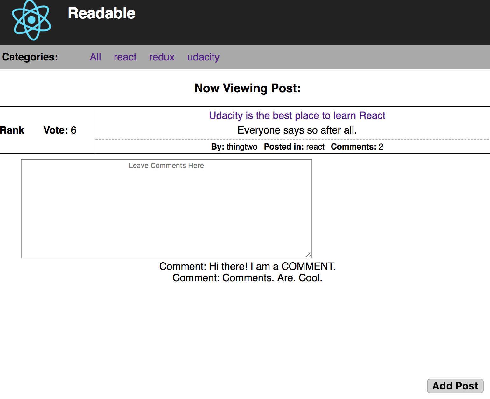

# React Nanodegree Readable Project

## Basic Overview

This project uses React and Redux to build the front-end for a fully-interactive, post-sharing site from scratch (using a supplied API).

- Uses the supplied API to manage requests
- React to build the framework
- React Router for routing
- Redux to manage state
- Redux middleware (thunk) to manage asynchronous requests

### Functions

Starting at the home page, users can:

- View all posts
- Click on a category or navigate to `/r/categoryName` to view posts in a category
- UpVote or DownVote posts
- Sort posts by **rating** or **date**
- Click **Add Post** button to add a new post
- Click on Edit to edit or delete any existing post
- Click on post's name or comments to go to that post's page
  - View comments for each post
  - Add new comments
  - Vote on comments
  - Edit or delete any existing comments

## How to Use

1. Clone the repository
2. Navigate to the `reactnd-readable-server` directory in terminal
  * Run `npm install`
  * Run `node server`
3. Navigate to the root directory
  * Run `npm install`
  * Run `npm run start`